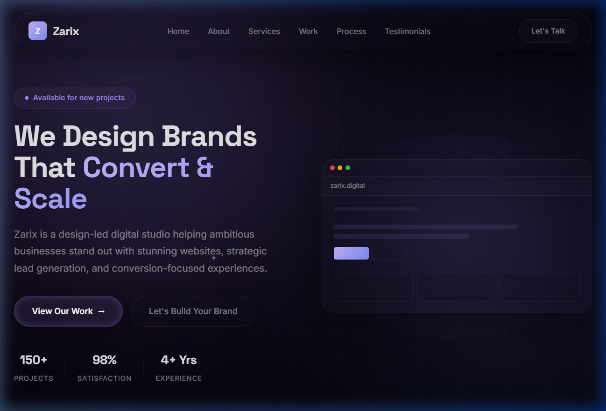

<div align="center">

# 🚀 Zarix — Digital Studio Portfolio

**Premium Web Design · Lead Generation · Brand Strategy**

[](https://chaudharyzaid56-lang.github.io/zarix-portfolio/)
[](https://chaudharyzaid56-lang.github.io/zarix-portfolio/)
[](./LICENSE)

<br />



<br />

*A conversion-focused portfolio for Zarix — a design-led digital studio helping ambitious businesses stand out with stunning websites, strategic lead generation, and measurable growth.*

</div>

---

## ⚡ Quick Overview

| | |
|---|---|
| 🎨 **Design** | Dark futuristic UI with glassmorphism, liquid-glass effects, and cinematic micro-animations |
| 📱 **Responsive** | Pixel-perfect across desktop, tablet, and mobile devices |
| ⚡ **Performance** | Lightweight — zero frameworks, pure HTML/CSS/JS |
| 🎯 **Conversion** | Strategic CTA placement designed to turn visitors into paying clients |
| 🔍 **SEO** | Semantic HTML5, structured meta tags, and clean heading hierarchy |
| ♿ **Accessible** | ARIA labels, keyboard nav, and reduced-motion support |

---

## 🛠️ Tech Stack

<div align="center">


</div>

---

## ✨ Key Features

- **🌙 Dark Futuristic Theme** — Charcoal, silver & violet palette with a premium feel
- **🪟 Glassmorphism Cards** — Frosted-glass layering with backdrop blur effects
- **🌊 Liquid-Light Hover Effects** — Dynamic, interactive micro-animations
- **📊 Animated Stats** — Count-up animations triggered on scroll
- **🎬 Scroll Reveal** — Smooth entrance animations via IntersectionObserver
- **📋 Service Showcase** — Detailed service cards with hover effects
- **💼 Project Portfolio** — Filterable work gallery with case study previews
- **⭐ Testimonials** — Client reviews with star ratings
- **📞 Contact Section** — Direct CTA with email and phone integration
- **🔄 Auto-Deploy** — GitHub Actions workflow for seamless deployment

---

## 📂 Project Structure

```
zarix-portfolio/
├── index.html                # Main portfolio page
├── style.css                 # Premium dark theme & animations
├── script.js                 # Scroll animations & interactivity
├── preview.png               # Repository preview image
├── logo/                     # Brand assets
│   └── Untitled design.png   # Zarix logo
├── .gitignore                # Git ignore rules
├── README.md                 # You are here
└── .github/
    └── workflows/
        └── deploy.yml        # Auto-deploy to GitHub Pages
```

---

## 🚀 Getting Started

**Clone & run locally:**

```bash
# Clone the repository
git clone https://github.com/chaudharyzaid56-lang/zarix-portfolio.git

# Navigate to the project
cd zarix-portfolio

# Open in browser (or use Live Server in VS Code)
start index.html
```

No dependencies. No build step. Just open and go.

---

## 📦 Deployment

This project auto-deploys to **GitHub Pages** via GitHub Actions.

Every push to `main` triggers a fresh deployment — no manual steps required.

| Step | Tool |
|------|------|
| Source | `main` branch |
| Build | GitHub Actions (`deploy.yml`) |
| Host | GitHub Pages |
| URL | [chaudharyzaid56-lang.github.io/zarix-portfolio](https://chaudharyzaid56-lang.github.io/zarix-portfolio/) |

---

## 📬 Get In Touch

<div align="center">

[](mailto:zarixagency@gmail.com)
[](https://instagram.com/zarix.digital)
[](https://github.com/chaudharyzaid56-lang)

</div>

---

<div align="center">

**Built with ❤️ by [Zarix](https://chaudharyzaid56-lang.github.io/zarix-portfolio/)**

© 2026 Zarix. All rights reserved.

</div>
